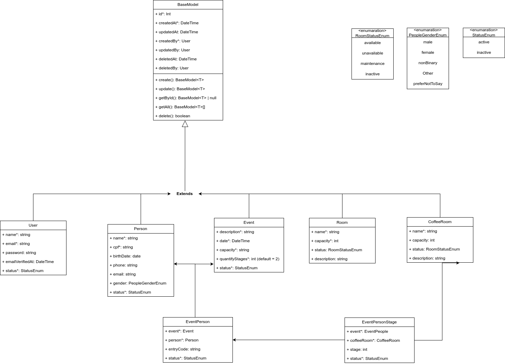

# Planifica App - Gestão organizada de eventos e salas

O nome "Planifica" vem do verbo "planificar", ou seja, organizar ou desenvolver um plano, criar um esquema para algo

<div align="center">
  
</div>

## Stacks

<div align="center">
   &nbsp;&nbsp;&nbsp;&nbsp;&nbsp;
   &nbsp;&nbsp;&nbsp;&nbsp;&nbsp;
   &nbsp;&nbsp;&nbsp;&nbsp;&nbsp;
   &nbsp;&nbsp;&nbsp;&nbsp;&nbsp;
  
</div>

## UML Base
Foi montado um modelo BASE UML para como ficaria as Classes de Modelo e Entidades principais do sistema, bem com sua relação por Herança com outras classes

<div align="center">
  
</div>


## Rodar o projeto

### Passo a passo
-Criar arquivo .env com base no .env.example

```
cp .env.example .env 
```

-Criar arquivo .env.testing com base no .env.testing.example - Contém as variáveis de ambiente para rodar os testes de integração

```
~ cp .env.example .env.testing
```

### Defina as variáveis ambiente de acordo com seu ambiente

```
APP_URL=http://localhost:8000

#Variaveis para uso no frontend com o Vite | Importante: Necessário o prefixo VITE_ para que o Vite reconheça
VITE_DEV_SERVER_URL=http://localhost:5173
VITE_BACK_END_BASE_URL=http://localhost:8000/api/v1

LOG_CHANNEL=stack
LOG_DEPRECATIONS_CHANNEL=null
LOG_LEVEL=debug

#Banco de dados da aplicação de teste - Usado para criação do docker
DB_CONNECTION=mysql
DB_HOST=db
DB_PORT=3306
DB_DATABASE='your_db'
DB_USERNAME='your_user'
DB_PASSWORD='your_pass$@123'

```

### Defina as variáveis ambiente do .env.testing de acordo com seu ambiente de teste
```
APP_URL=http://localhost:8000

#Variaveis para uso no frontend com o Vite | Importante: Necessário o prefixo VITE_ para que o Vite reconheça
VITE_DEV_SERVER_URL=http://localhost:5173
VITE_BACK_END_BASE_URL=http://localhost:8000/api/v1

LOG_CHANNEL=stack
LOG_DEPRECATIONS_CHANNEL=null
LOG_LEVEL=debug

#Banco de dados da aplicação de teste - Usado para criação do docker
DB_CONNECTION=mysql
DB_HOST=db
DB_PORT=3307
DB_DATABASE='your_db_testing'
DB_USERNAME='your_user_testing'
DB_PASSWORD='your_pass$@123_testing'

```


#### IMPORTANTE: Caso já tenha subido o container e depois modificado as variáveis de ambiente que afetam outros containers, como dados do db, por exemplo será necessário recriar os volumes persistentes, com isso ele recriará o banco de dados com as variáveis corretas

```
docker-compose down -v --remove-orphans
docker-compose up -d --build
```

### Iniciar os containers Docker

```
docker-compose up -d
```

### Rode os comandos abaixo focados no container "app" (Essa configuração só será necessária uma vez, ao rodar o projeto pela primeira vez)

```
docker-compose exec app sh

docker-compose exec app php artisan key:generate #Caso não tenha gerado a key anteriormente
docker-compose exec app php artisan migrate #Para rodar as migrações do banco de dados

docker-compose exec app php artisan key:generate --env=testing #Para criar a key no .env.testing
```

### Crie o primeiro usuário do sistema com seeder

```
docker-compose exec app php artisan db:seed --class=FirstAdminUserSeeder
```

Credenciais do usuário criado: email: admin@example.com | pass: password@123

### Instalar os pacotes npm para rodar o frontend(Caso ainda não tenha sido instalados)
```
npm i
```

### Iniciar os servidores de desenvolvimento
```
npm run dev
```
### Para rodar os testes de integração (Lembre-se de configurar o .env.testing)
```
php artisan test
```
### Para monitorar os logs dos serviços docker, utilize os comandos abaixo

#### Logs do PHP-FPM
```
docker logs -f planifica-app
```
#### Logs do Nginx
```
docker logs -f nginx-server
```
#### Logs do Vite
```
docker logs -f planifica-vite
```
### Para ambiente de produção, rodar o build:
```
docker compose run --rm npm run build  # gera o diretório public/build/...
```
----------------

### Explicação de como a integração do Laravel + Vue através do vite funciona
#### Porta 8000 (Laravel + Nginx)
O que roda: Aplicação Laravel (backend)

Como acessar: http://localhost:8000

Contém:

-Rotas da API (se configuradas)
-Assets compilados pelo Vite


#### Porta 5173 (Vite Dev Server - HMR)
O que roda: Frontend (Vue + Quasar) com Hot Module Replacement

Como acessar: http://localhost:5173

Contém:

-Compilação em tempo real dos arquivos Vue/JS
-Injeção automática de mudanças no navegador (HMR)

#### Modo Produção (npm run build):

-Os assets são compilados para /public/build
-Laravel serve tudo na porta 8000
-Não há comunicação com a porta 5173
-O comportamento não é SPA puro, o Laravel continua sendo um backend MVC tradicional e as views Blade irão carregar componentes Vue compilados e as Rotas para API REST que fazemos no "frontend" da aplicação funcionaria normalmente.

### Sugestão de melhorias futuras

-Utilização de JWT Token para Autenticação, no projeto foi utilizado um Personal Access Token utilizando o Laravel Sanctum, ela não tem dados embutidos no token, somente um token de acesso para autenticação básica

-Implementação de Interfaces para a estrutura com o Pattern de Repository e Services.

-Adição de uma classe que implementa automaticamente nas migrações futuras os parâmetros do moodelo base, herdados da classe de modelo base (BaseModel)

-Separar em dois repositórios ou projetos, um para o frontend e outro para o backend. É possível separar facilmente o projeto em um repositório "frontend", mantendo a estrutura de API do Laravel => Nesse cenário teríamos um SPA puro, poderíamos separar equipes de desenvolvimento 

-Implmentação do i18n para preparar o sistema para multi linguagens- Escolhido pela não implementação inicial por conta do nível de "complexidade" adicionada no frontend sem necessidade inicial, mas facilmente podemos adicionar no futuro

-Implementação de testes mais completos e ter uma cobertura mair, implementar também testes e2e(Com Cypress ou outra ferramenta) e testes de integração

-Utlização de Linter no código para padronização de código e melhoria da legibilidade
